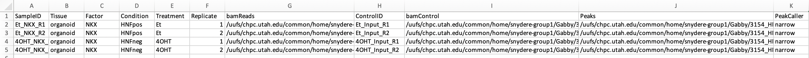
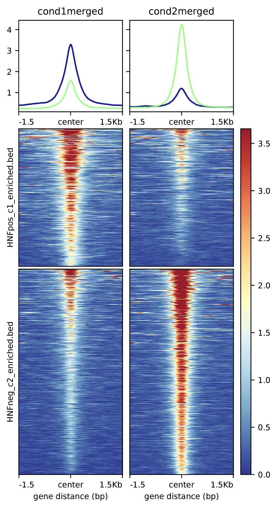

# SnyderLab_ChIPseq
### Gabriela Fort and Katy Gillis

## Description
A set of scripts and tools for analysis of ChIP-sequencing datasets. Includes useful scripts for alignment
of fastq files, peak calling, motif finding, peak annotation, merging replicates, identification of differential 
peaks between samples, and intersecting ChIP-seq and RNA-seq datasets.

## Configuration:
### Cloning this repository
Clone this repository into your home (~) directory:
```
git clone https://github.com/GabrielaFort/SnyderLab_ChIPseq.git
```

Add executable files located in ```SnyderLab_ChIPseq/scripts``` to your path variable so that they are accessable from anywhere:
```
vi ~/.bashrc
```
Add this new line underneath where it says export PATH=.....:
```
export PATH=/uufs/chpc.utah.edu/common/home/uID/SnyderLab_ChIPseq/scripts:$PATH
```

### Configuring Python
Many of these scripts require python - CHPC does not maintain a central python distribution, so miniconda/python must be user installed.
To configure python and the miniconda environment used to run these analyses, run the ```config.sh``` script from the scripts directory of this cloned repo:
```
cd $HOME/SnyderLab_ChIPseq/scripts
./config.sh
```
Note: Only perform this step once!

## Step 1: Alignment 
### ```alignment.sh```
```
Usage: alignment.sh [{-d|--directory} path to input directory] [{-g|--genome} genome]

This bash script will take an input directory containing fastq.gz files - each sample should have three files - R1, R2, and UMI
Keep the same names as they are default exported from Gnomex!

{-d|--directory} directory      -- Set path to directory with fastq files
{-g|--genome} genome            -- Set genome to align to (mm10, mm39, hg19, hg38)
{-h|--help}                     -- Prints this help message and exits
```
This script is meant to be compatible with file names exported from Gnomex. It will take a genome build and a directory containing 
fastq files downloaded from Gnomex as input. It can handle samples from multiple experiments at once that have 'R1', 'R2', and 'R3'
in their names to designate Read 1, UMI, Read 2 fastq files (default naming from Gnomex). For each sample, this script will trim sequencing
adaptors using [Cutadapt](https://cutadapt.readthedocs.io/en/stable/), align reads to the designated reference genome using [Bowtie2](https://bowtie-bio.sourceforge.net/bowtie2/manual.shtml), deduplicate reads based on the provided UMI fastq files using Tim Parnell's [UMIScripts](https://github.com/HuntsmanCancerInstitute/UMIScripts/tree/master) tool, convert sam to sorted bam files using [Samtools](http://www.htslib.org/), 
and will export summary files from alignment and deduplication.

## Step 2: Peak Calling/Annotation/Motif Enrichment
### ```peak_calling.sh```
```
Usage: peak_calling.sh [{-e|--experimental} experimental] [{-c|--control} control] [{-o|--output} name] [{-g|--genome} genome] [{-q|--qvalue} Optional:q-value]

This bash script will take an input experimental (chip) bam file and a control (input)
bam file, genome, output directory name, and an optional q-value cutoff. 
It will return Macs2 called peaks in .bed format, bigwig files for chip and control samples,
and will run HOMER to find enriched motifs and annotate peaks.

{-e|--experimental} chip           -- Experimental bam file
{-c|--control} input control       -- Control bam file
{-o|--output} name                 -- Set name of output directory and file headers
{-g|--genome} genome               -- Input genome that bam files are aligned to (mm10, mm39, hg19, hg38)
{-q|--qvalue} qvalue               -- Optional: Set q-value cutoff for Macs2. Default=0.01
{-h|--help}                        -- Prints this help message and exits
```
This script will run the [Macs2](https://pypi.org/project/MACS2/) peak calling tool on two input bam files - an experimental (chip) file and a control (input) file. It will also run [HOMER motif enrichment analysis](http://homer.ucsd.edu/homer/motif/) (findMotifsGenome.pl) on called peaks and will annotate peaks to the nearest TSS and run GO enrichment analysis on annotated peaks using the HOMER suite's [annotation tool](http://homer.ucsd.edu/homer/ngs/annotation.html) and will append the annotated gene names to the output bed file from Macs2.

## Step 3: Combining Biological Replicates
### ```combine_replicates.sh```
```
Usage: combine_replicates.sh [{-a|--rep1} Replicate1] [{-b|--rep2} Replicate2] [{-o|--output} name] [{-g|--genome} genome]

This bash script will take paths to Macs2 output directories from
two replicates, a reference genome, and an output directory name.
It will return bed files, merged bw files, and annotations and HOMER analysis on
only overlapping peaks between the two replicates. It will also use deeptools to
create tornado plots of the two replicates side by side.

{-a|--rep1} Replicate1          -- Path to peak calling output directory for Rep 1
{-b|--rep2} Replicate2          -- Path to peak calling output directory for Rep2
{-g|--genome} genome            -- Input genome that files are aligned to (mm10, mm39, hg19, hg38)
{-o|--output} name              -- Set name of output directory
{-h|--help}                     -- Prints this help message and exits
```
This script uses [bedtools intersect](https://bedtools.readthedocs.io/en/latest/content/tools/intersect.html) to identify overlapping peaks across two biological ChIP-seq replicates. It requires the path to the directory that is output from the Macs2 peak calling script for each biological replicate. It will return a new bed file (containing annotated gene names) of only intersected peaks, a merged bw file, tornado plots, and will run HOMER motif enrichment analysis on overlapping peaks and GO analysis on overlapping annotated genes.
**Note:** In order for this script to work - do not change the names of the output directories or files from step 2: ```peak_calling.sh```!  

## Differential Binding Analysis
### ```diffbind.sh```
```
Usage:  [{-d|--diffbind} Diffbind Input File] [{-f|--FDR} Optional:FDR Cutoff] [{-o|--output} name] [{-g|--genome} genome]

This bash script will take an input Diffbind-formatted file, an optional FDR cutoff for differential peak calling,
a reference genome, and an output directory name. It will perform Diffbind analysis and return bed files of the output and differential peaks,
will run HOMER on differential peaks, and will create many plots demonstrating sample comparisons.

{-d|--diffbind} Diffbind_input        -- Diffbind-formatted input file
{-g|--genome} genome                  -- Input genome that files are aligned to (mm10, mm39, hg19, hg38)
{-o|--output} name                    -- Set name of output directory
{-f|--FDR} FDR cutoff                 -- Optional: Set FDR cutoff for differential peaks (Default=0.05)
{-h|--help}                           -- Prints this help message and exits
```
This script uses the [diffbind R package](https://bioconductor.org/packages/release/bioc/vignettes/DiffBind/inst/doc/DiffBind.pdf) to identify differential peaks across two conditions with biological replicates. This script takes as input a diffbind-formatted csv file (example below), a genome that the samples are aligned to, and a name for an output directory. It will perform differential analysis using DEseq2 and edgeR and will export bed files and annotated bed files containing differential peaks in each condition (based on FDR cutoff), will perform HOMER analysis on sets of differential peaks, and will generate a number of plots illustrating differences between the two conditions.

**Note:** The input diffbind csv file must match the formatting of the following example:




You must designate **absolute paths** to the bam and bed files, and you must have the same columns and order of columns in the input csv file.

## Generating Plots
### ```deeptools_heatmaps.sh```
```
Usage: deeptools_heatmaps.sh [{-B|--bed1} condition 1 bed] [{-b|--bed2} condition 2 bed] [{-g|--genome} genome] [{-Ca|--coverage1a} condition 1 rep1 bw] [{-Cb|--coverage1b} condition 1 rep2 bw] [{-ca|--coverage2a} condition 2 rep1 bw] [-cb|--coverage2b} condition 2 rep2 bw]

This bash script will take two input bed files (i.e. from two different conditions)
and four bigwig files (i.e. from two replicates of two conditions).
It will return heatmaps of coverage (both individual reps and merged) over the input bed files,
individually and merged, and will perform k-means clustering and output bed files associated with the clusters.

{-B|--bed1} Bed 1                  -- Condition 1 bed file
{-b|--bed2} Bed 2                  -- Condition 2 bed file
{-g|--genome} genome               -- Input genome that files are aligned to (mm10, mm39, hg19, hg38)
{-Ca|--coverage1a} bw 1 rep1       -- Condition 1 Replicate 1 bigwig file
{-Cb|--coverage1b} bw 1 rep2       -- Condition 1 Replicate 2 bigwig file
{-ca|--coverage2a} bw 2 rep1       -- Condition 2 Replicate 1 bigwig file
{-cb|--coverage2b} bw 2 rep2       -- Condition 2 Replicate 2 bigwig file
{-h|--help}                        -- Prints this help message and exits
```
This script utilizes [deepTools](https://deeptools.readthedocs.io/en/develop/) to generate heatmaps and coverage plots of signal across
sets of input peaks. It is designed to compare two conditions and takes as input two bed files (i.e. could represent differential peaks
determined by diffbind) and four bigwig coverage files (two biological replicates from two conditions). It will generate many different 
plots including signal over each individual bed file in both conditions, with the replicates either shown separately or merged together,
as well as plots in which the bed files have been combined into one set of peaks. 

Shown below are example output plots from this script showing ChIP-seq signal at sets of differential peaks determined by DiffBind:

 
 


